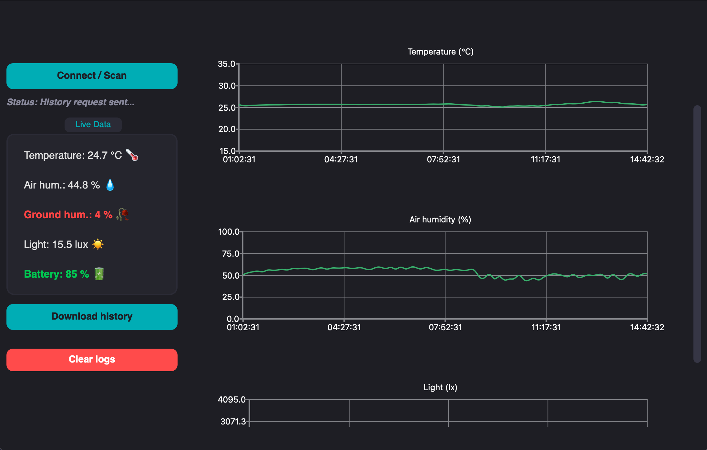
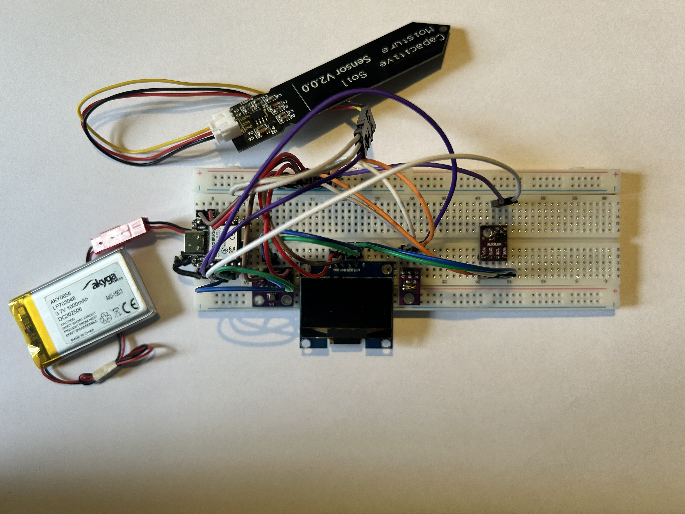
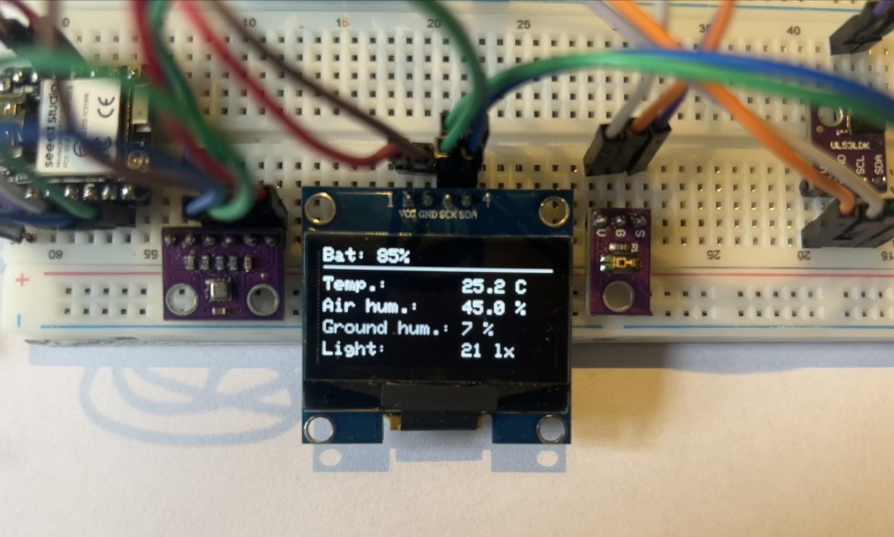

# 🌱 Smart Plant Monitor

*BUILT FOR AGH CS C++ COURSE*

System designed to monitor plant health.
Built with C++, the project consists of an ESP32-C6 based hardware node and a Qt6 Desktop Application.

The system features Bluetooth Low Energy communication, local data logging, and a gesture-activated OLED display.

## Key Features
- **Real-Time Monitoring**: Tracks Soil Moisture, Ambient Temperature, Air Humidity, Light Intensity (LDR), and Battery Level.
- **Gesture-Activated UI**: Uses a VL53L0X Time-of-Flight sensor to detect hand waves, waking up the OLED display for 10 seconds to conserve battery.
- **Local Data Logging**: Stores historical data offline in flash memory using LittleFS when the client is disconnected.
- **Qt6 Desktop Client**: PC dashboard featuring charts and historical data synchronization.

## Hardware Components
- **Microcontroller**: Seeed Studio XIAO ESP32-C6
- **Display**: 1.3" OLED Display (SH1106, I2C)
- **Proximity Sensor**: VL53L0X Time-of-Flight Laser Sensor (I2C)
- **Environment Sensor**: BME280 (Temperature & Humidity, I2C)
- **Analog Sensors**: Capacitive Soil Moisture Sensor & Photoresistor.
- **Power**: 3.7V Li-Po Battery

## Software stack
**Firmware (ESP32-C6)**
- **Environment**: PlatformIO / Arduino Core for ESP32 (v3.0+)
- **Language**: C++
- Key Libraries:
    - h2zero/NimBLE-Arduino (Optimized BLE stack)
    - adafruit/Adafruit_SH110X (OLED driver)
    - adafruit/Adafruit_VL53L0X (ToF sensor driver)
    - LittleFS (File system for data logging)

**Desktop Application**
- Framework: Qt 6
- Language: C++
- Modules: QtBluetooth (BLE Client), QtCharts (Data visualization)

## BLE Architecture

The device operates as a **BLE Peripheral**.

| Characteristic | UUID | Properties | Purpose |
| - | - | - | - | 
| Live Data | `beef1234-4321-beef-4321-beef12345678` | `READ`, `NOTIFY` | Streams current sensor readings. |
| Time Sync | `cafe1234-4321-cafe-4321-cafe12345678` | `WRITE` | Allows the PC to set the ESP32's UNIX epoch time. |
| History | `dada1234-4321-dada-4321-dada12345678` | `NOTIFY`, `WRITE` | Used to trigger and transmit binary logs of past data. |
| Acknowledge | `dead1234-4321-dead-4321-dead12345678` | `WRITE` | PC confirms receipt of history, triggering log cleanup on the ESP32. |

## Getting started
1. **Flashing the Firmware**
    1. Open the firmware folder in VS Code with the PlatformIO extension.
    2. Connect your XIAO ESP32-C6 via USB-C.
    3. Build and Upload the project.

2. **Running the Qt Client**
    1. Open the client folder in Qt Creator.
    2. Ensure you have the QtBluetooth and QtCharts modules installed.
    3. Build and run the project (Desktop target).
    4. Click "Connect", wait for the BLE discovery to find XIAO-C6-Kwiatek
    5. Click "" to download historical data and read current values.

## Images

**Desktop Dashboard**:

**Hardware Setup**:

## Authors

- Paweł Bolek